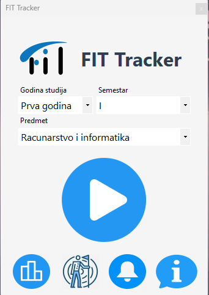
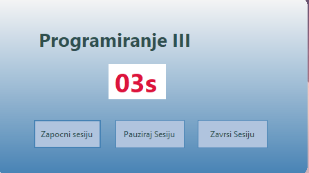
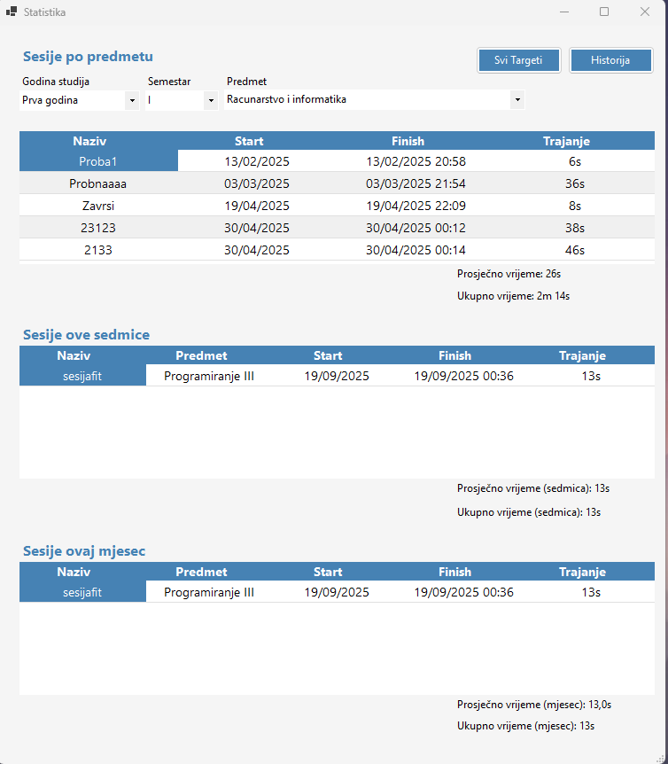

<h1 align="center">📚 Fit Tracker</h1>

  A Windows Forms C# application for tracking study sessions of FIT (Faculty of Information Technologies) students.  
  Manage, monitor, and analyze your learning progress with built-in statistics, targets, and notifications.  
  Powered by <strong>SQLite</strong> for data storage.

---

## 📌 Features

✅ **Start / Pause / Resume Study Sessions** – log your learning in real time  
✅ **SQLite Database Integration** – store all sessions locally  
✅ **Statistics Dashboard** – weekly, monthly, and per-subject session stats  
✅ **Subject Targets** – set study goals for each subject  
✅ **Study Insights** – analyze patterns and trends in your learning  
✅ **Notifications** – reminders and progress updates  

---

## 🛠️ Tech Stack

| Layer          | Technology |
|----------------|------------|
| **Frontend**   | WinForms (.NET C#) |
| **Backend**    | .NET Framework / .NET 6+ |
| **Database**   | SQLite |
| **Data Analysis** | Custom statistical algorithms |
| **Notifications** | Windows Toast Notifications |

---

## 📸 Screenshots

   
  <em>Startna forma</em>

   
  <em>Aktivna sesija</em>

   
  <em>Statistika</em>

---

Download verzija 1.0
https://www.mediafire.com/file/vxsjgkzsr8vtpth/FiT_Tracker_1.0.rar/file
